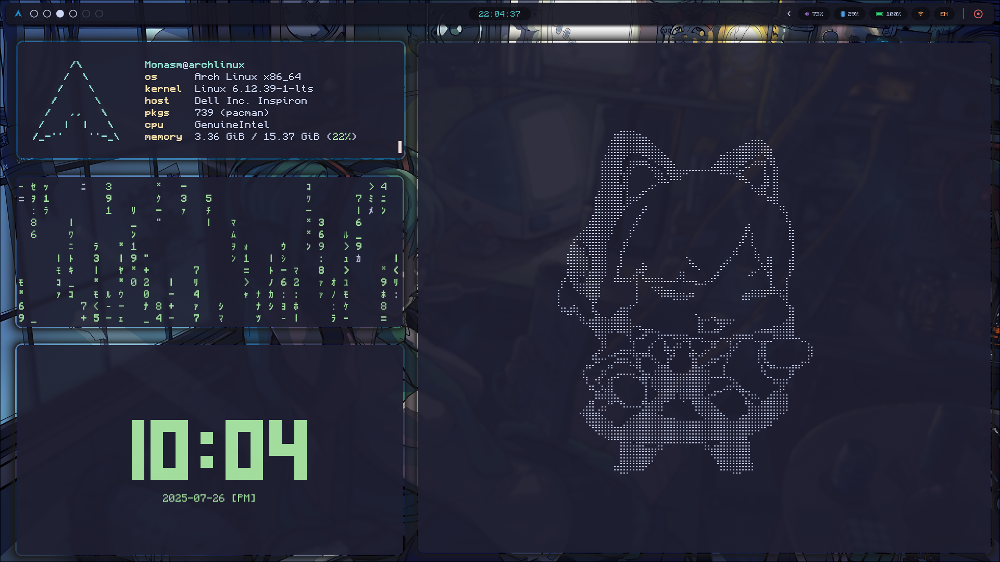

# monasm-dots

My personal dotfiles for Arch Linux. This repository is not actively maintained. Some elements used in these scripts are not included here (for example, my wallpaper is stored somewhere on my PC — I forgot the exact location lol).

Use with caution! Make a backup of your current setup before trying this out. Alternatively, you can tweak your existing configs to your liking.
Anddd, the code is extremly messy UwU sry.

*** Update : Automated-install script underway!!! (Due date unknown)

## Overview

- **Wayland compositor:** [Hyprland](https://wiki.hypr.land/) 
- **Widgets and status bars:** [EWW](https://github.com/elkowar/eww)  
- **Terminal emulator:** [Kitty](https://sw.kovidgoyal.net/kitty/)

## Preview

## Screenshots

